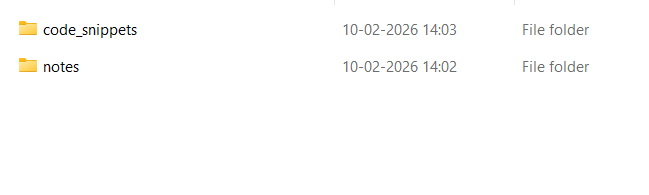

# Genie-Agentic-RAG
A minimal GPT-RAG chatbot repo. For example, if developing a chatbot that answers questions on PySpark, all related material can be added
to knowledge base and the app can be developed. 

# Sections that need to be edited.

# List of supplementary folders/codes not used for the minimal app development and launch. (Useful for app upgrade)
./src/genie/cli
./src/genie/frontend/routes/batch
./src/genie/frontend/routes/eval
# RAG_template
