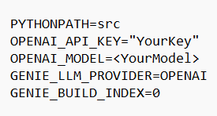
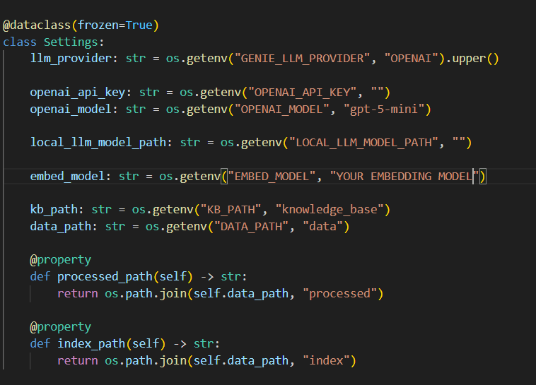
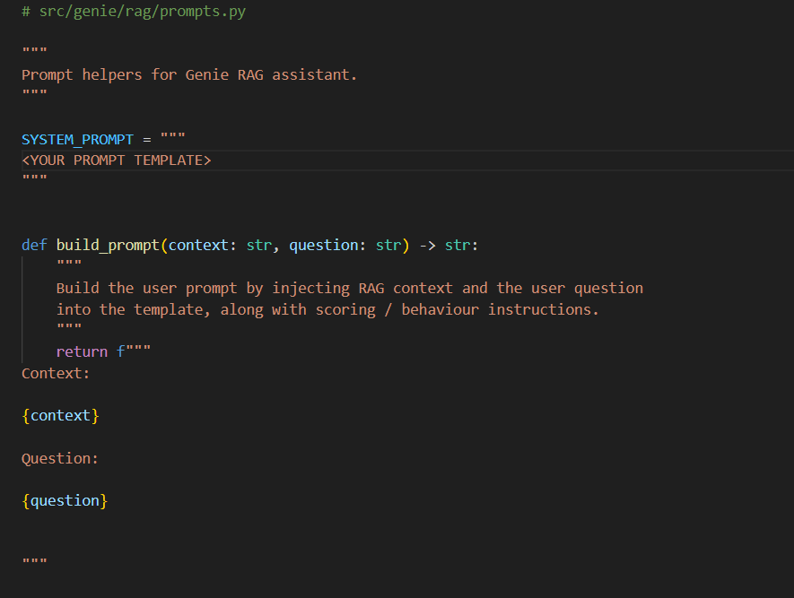
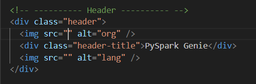

# 1. Genie-Agentic-RAG
A minimal GPT-RAG-Windows chatbot repo. For example, if developing a chatbot that answers questions on Homeopathy, all related material can be added to knowledge base and the app can be developed.

# 2. Sections that need to be edited.

## 2.1 edit .env
1. Add OPENAI API KEY
2. Model such as gpt-4o-mini
3. GENIE_BUILD_INDEX = 0 if chunking already done, GENIE_BUILD_INDEX = 1 if chunking needs to be done (when launching app - online).

## 2.2 edit knowledgebase
1. Add your pdfs, industry expert notes and other relevant data here

## 2.3 edit embedding model name
1. Add embedding model

## 2.4 Complete Prompt engineering

## 2.5 Add relevant images for UI

# 3. Steps for development and launching the app (First time)

1. Complete steps in - Sections that need to be edited.
Open Powershell.
2. run python -m venv .venv
3. run .venv\Scripts\Activate.ps1
4. run pip install -r requirements.txt
5. change GENIE_BUILD_INDEX=1 in .env if running for the first 
time (after updates to knowledge base)
6. python -c "import sys; sys.path.append('src'); import genie.config"
7. python -c "import sys; sys.path.append('src'); import genie.cli.build_index.main; main()"
8. uvicorn src.genie.frontend.api:app --reload --port 8001

# 4. Steps for launching the app

1. run .venv\Scripts\Activate.ps1
2. python -c "import sys; sys.path.append('src'); import genie.config"
3. uvicorn src.genie.frontend.api:app --reload --port 8001

# 5. List of supplementary folders/codes not used for the minimal app development and launch. (Useful for app upgrade)
1. ./src/genie/cli\
2. ./src/genie/frontend/routes/batch\
3. ./src/genie/frontend/routes/eval\

